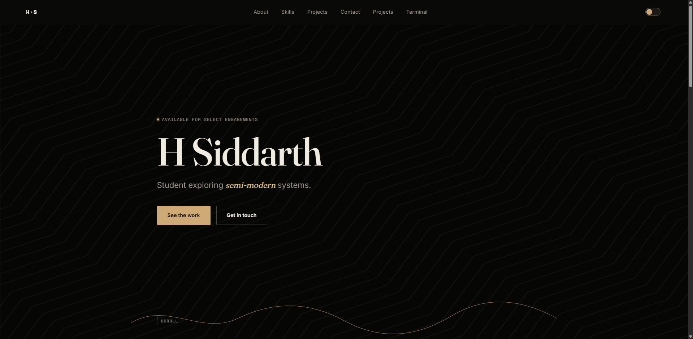

# H Siddarth — Personal Resume Website



A modern, responsive personal resume and portfolio website built with **HTML, CSS, and JavaScript**.

This project is the source code behind my personal website, showcasing my profile, skills, projects, achievements, and ways to connect with me.

## 🌐 Live Website

**[Visit my website](https://thehsiddarth.com)**

## 👨‍💻 About

I'm **H Siddarth**, a student interested in programming, data science, technology, and building projects.

I use this website to document and showcase the things I'm learning and building.

My current areas of interest include:

* 🐍 Python
* 📊 Data Science
* 🌐 Web Development
* 🤖 Artificial Intelligence
* 🧪 Scientific Computing
* 💻 Software Development
* 📚 Continuous Learning

## ✨ Features

* Responsive design
* Clean personal portfolio layout
* Light and dark themes
* Project showcase
* Resume-style profile
* Social and professional links
* Mobile-friendly interface
* Lightweight frontend with no unnecessary frameworks

## 🛠️ Built With

| Technology   | Purpose                       |
| ------------ | ----------------------------- |
| HTML5        | Website structure             |
| CSS3         | Styling and responsive design |
| JavaScript   | Interactivity                 |
| GitHub Pages | Hosting                       |

## 📁 Project Structure

```text
Basic-Resume/
│
├── sites/
│   └── Additional website files
│
├── index.html
├── style.css
├── script.js
│
├── dark.jpg
├── light.jpg
│
├── CNAME
├── README.md
├── LICENSE
├── CONTRIBUTING.md
├── CODE_OF_CONDUCT.md
├── .gitignore
└── .gitattributes
```

## 🚀 Run Locally

Clone the repository:

```bash
git clone https://github.com/SlashingBeast49/Basic-Resume.git
```

Navigate into the project:

```bash
cd Basic-Resume
```

Then open `index.html` in your browser.

For development, you can also use **VS Code + Live Server**.

## 📝 Customization

You can customize the website by editing:

```text
index.html
```

for the content and structure,

```text
style.css
```

for the appearance and layout,

and

```text
script.js
```

for interactive functionality.

Images and other static assets can be placed inside the appropriate project directories.

## 📌 Status

**Active Development**

This website is continuously updated as I build new projects, learn new technologies, and improve my portfolio.

## 🔗 Connect

* **GitHub:** [@SlashingBeast49](https://github.com/SlashingBeast49)
* **X:** [@thehsiddarth](https://x.com/thehsiddarth)
* **Instagram:** [@thehsiddarth](https://instagram.com/thehsiddarth)
* **LinkedIn:** [H Siddarth](https://www.linkedin.com/in/h-siddarth-b452bb414/)

## 📄 License

This project is licensed under the **GNU General Public License v2.0**.

See [`LICENSE`](LICENSE) for the full license text.

---

Built and maintained by **H Siddarth**.

*Learning. Building. Experimenting.*
